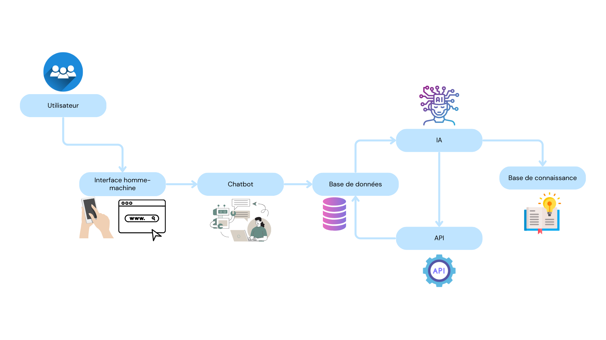

# TP2

## Sujet
- Dessiner une architechture de l'écosystème du chatbot pour répondre au cas de l'immobilier.
- Trouver un data set sur kaggle comme https://www.kaggle.com/discussions/general/327648
- Utiliser une technique de classification pour dire si un logement doit être intégré à l'agence ou pas.
- Comment pourriez vous utiliser ces données pour permettre au chatbot de mieux recommender les vendeurs de biens.

## Architechture

## Utiliser une technique de classification pour dire si un logement doit être intégré à l'agence ou pas.
Utilisation de RandomForestClassifier.

## Comment pourriez vous utiliser ces données pour permettre au chatbot de mieux recommender les vendeurs de biens.
Pour permettre au chatbot de mieux recommander les vendeurs de biens, on peut utiliser les données pour entraîner un modèle de machine learning qui identifierait les courtiers les plus performants. En analysant les informations disponibles le modèle peut apprendre quels courtiers ont les meilleurs taux de réussite pour des types de biens spécifiques. En intégrant ce modèle dans le chatbot, il pourra fournir des recommandations personnalisées aux utilisateurs, en suggérant les courtiers ayant les meilleures performances et les plus adaptées à la vente de leurs propriétés.