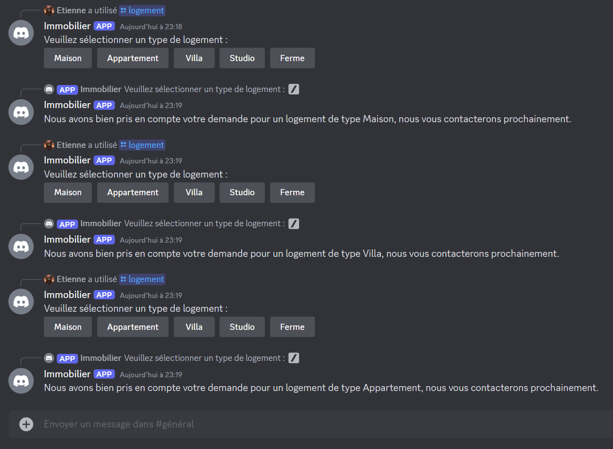

# TP3

## Sujet

1. Installer un bot que vous avez créé sur Discord
2. Ce bot doit pouvoir recevoir et envoyer des messages
3. Il doit intégrer une commande (par exemple répond avec une liste de biens)
4. Il doit pouvoir envoyer un message (par exemple : votre message a bien été pris en compte)

## Code et explication

J'ai utilisé Glitch pour démarrer le bot, voici mon code qui est le même que dans `TP3\discord-example-app` : https://glitch.com/edit/#!/chatbot-immobilier-etienne-legrand

J'avais essayé en local et avec Replit mais aucun des deux ne me permettait d'ajouter l'URL d'interaction dans le bot Discord, j'avais un message d'erreur.

## Conversation avec le bot discord

J'ai appelé trois fois le bot pour montrer que le type de logement change.

Je voulais aussi ajouter le choix avec une liste déroulante du nombre de chambres, de salle de bain et de la superficie mais je n'ai pas réussi.
